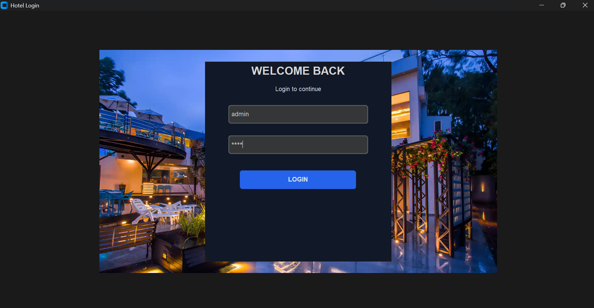
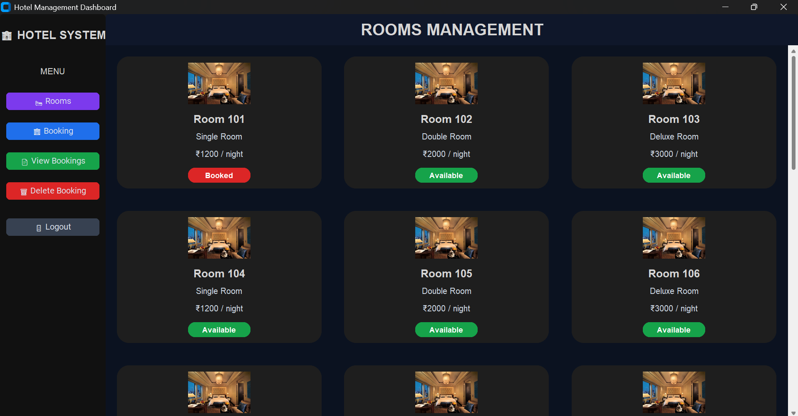
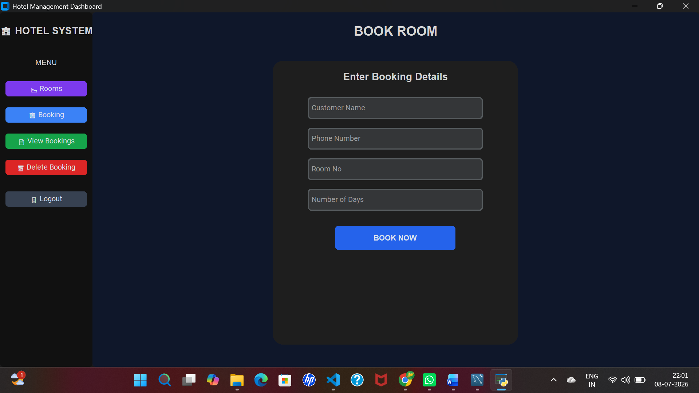
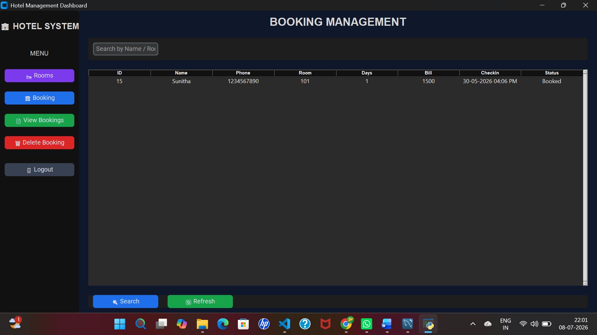
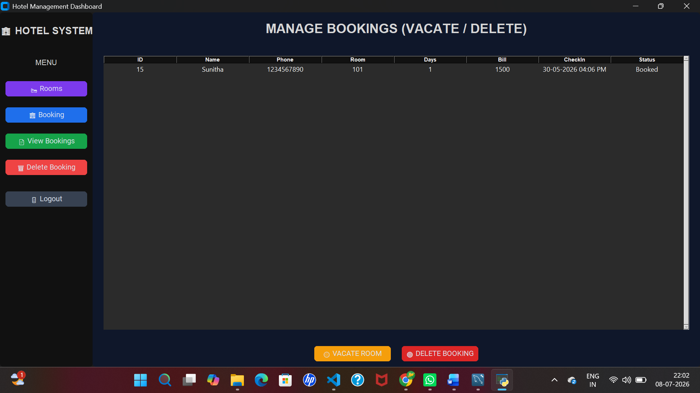

# 🏨 Hotel Management System (Python + MySQL + CustomTkinter)

## 📌 Overview
This is a desktop-based Hotel Management System built using Python, CustomTkinter, and MySQL.  
It provides a modern GUI for managing hotel rooms, bookings, and customer records.

---

## 🚀 Features

- 🔐 Login Authentication System
- 🏠 Dashboard with room statistics
- 🛏 Room Management (Grid UI view)
- 📝 Booking System with bill calculation
- 📄 View Bookings (Search & Refresh)
- 🗑 Delete Bookings (Row selection)
- 🚪 Logout functionality
- 🎨 Modern UI using CustomTkinter

---

## 🛠 Tech Stack

- Python 3.x
- CustomTkinter (GUI)
- MySQL (Database)
- Tkinter ttk (Tables)
- Pillow (Images)

---

## 🗄 Database Setup

Run SQL Queries before starting project

## 📸 Screenshots

### 🔐 Login Page

### 🏨 Rooms Page

### 📝 Booking Page

### 📋 View Bookings

### ❌ Delete Booking

